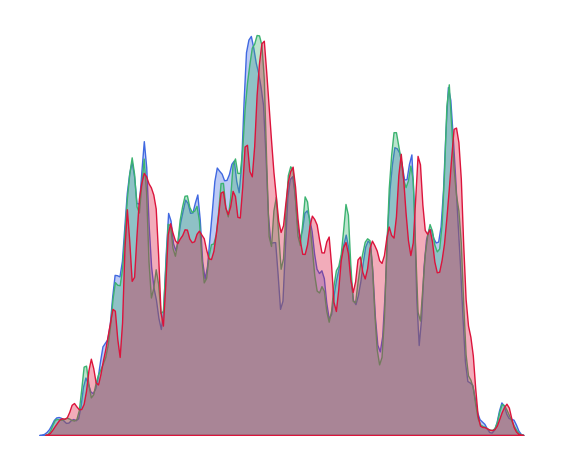

# Generate probability density plot of RGB values from an image

The output is a probability density plot of the RGB values from an image of your choosing with a transparent background.

## Installation and usage
```
pip install -r requirements.txt

python make-rgb-pd.py -h

usage: make-rgb-pd.py [-h] --img-path IMG_PATH --out-path OUT_PATH [--band-width BAND_WIDTH]

optional arguments:
  -h, --help            show this help message and exit
  --img-path IMG_PATH   path to the image you want to use
  --out-path OUT_PATH   path to save the figure
  --band-width BAND_WIDTH
                        factor to adjust density band width
```

## Example
Me and my dog


`python make-rgb-pd.py --img-path examples/my-dog.jpeg --out-path examples/my-dog-rgb --band-width 0.15`

